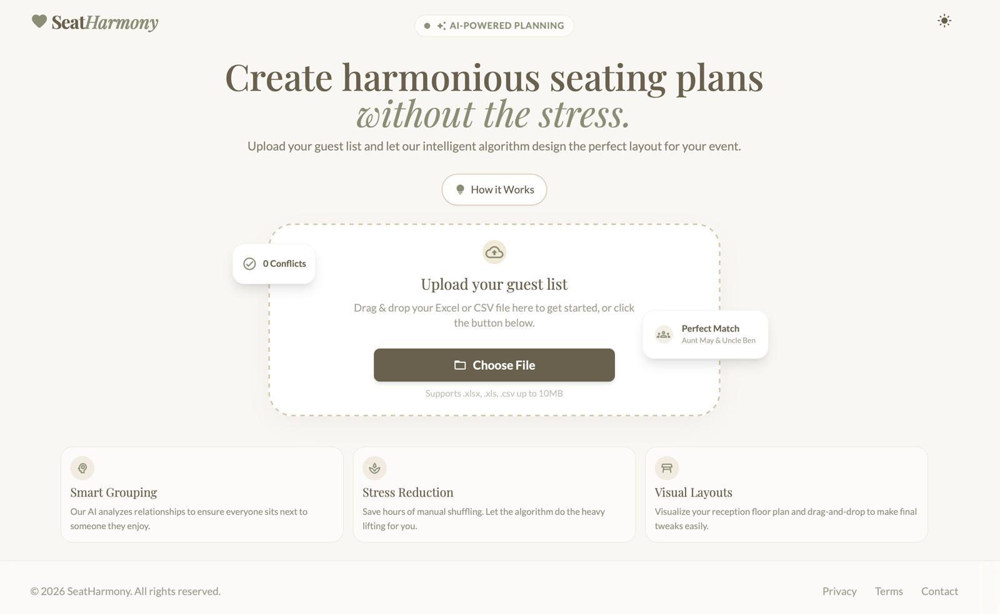
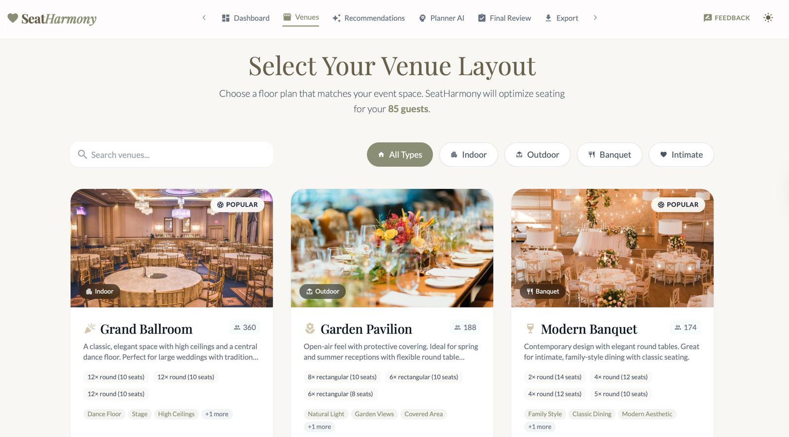
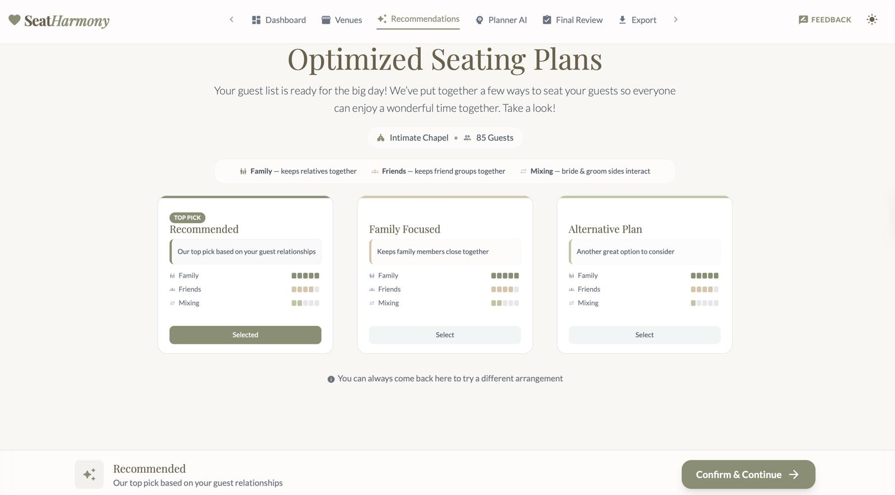
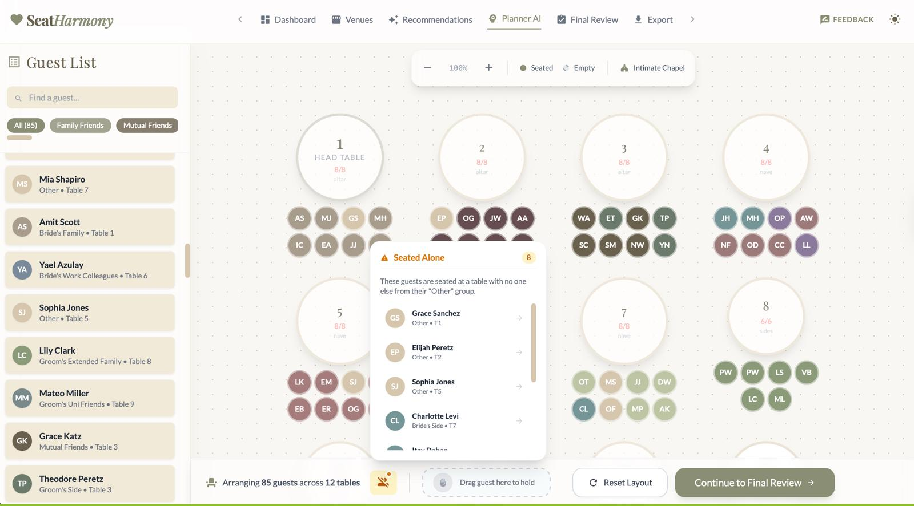
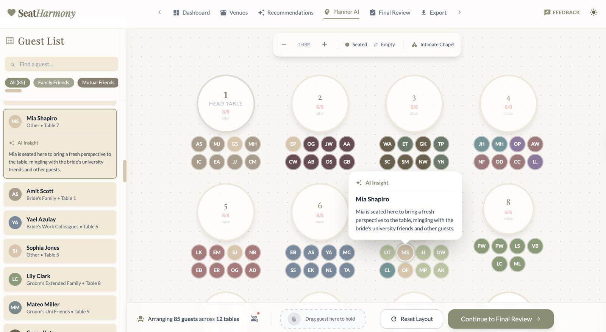
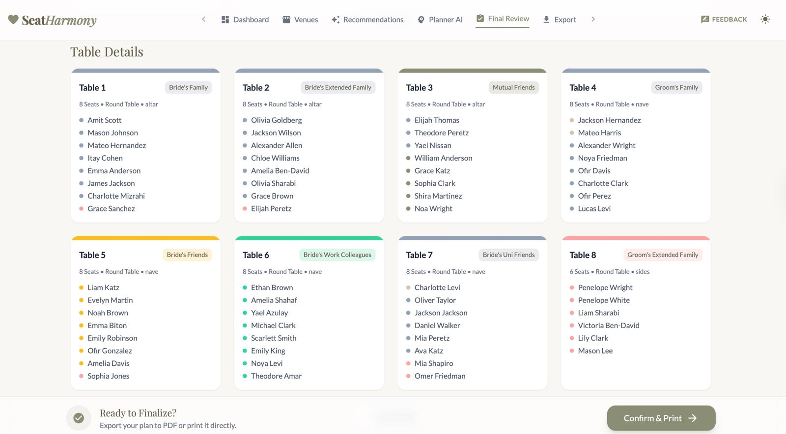
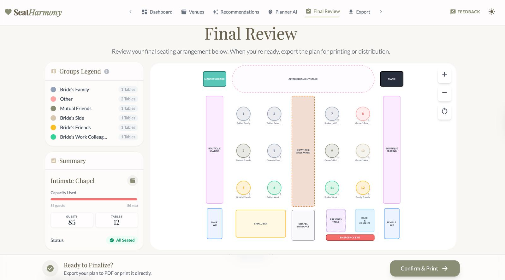
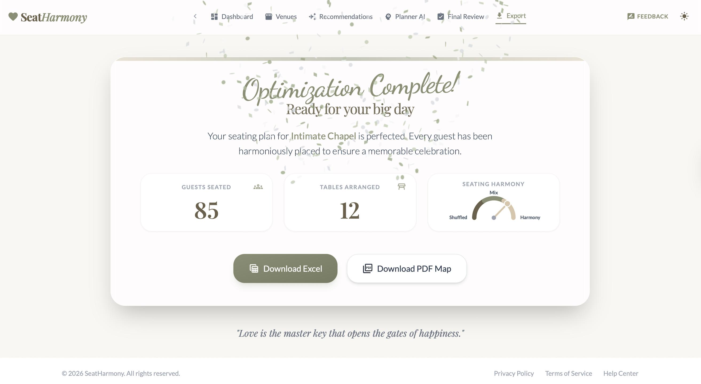

<div align="center">

# SeatHarmony

**AI-powered wedding seating planner that creates harmonious arrangements**

[](https://seatharmony-frontend.onrender.com)

[**Visit Live Site 🚀**](https://seatharmony-frontend.onrender.com)

---

[](https://reactjs.org/)
[](https://www.typescriptlang.org/)
[](https://www.python.org/)
[](https://fastapi.tiangolo.com/)

[](https://www.gurobi.com/)
[](https://groq.com/)
[](https://tailwindcss.com/)

[Features](#-features) • [Demo](#-demo) • [Getting Started](#-getting-started) • [Usage](#-using-the-application) • [Contributing](#-contributing)

</div> 

---

## What is SeatHarmony?

SeatHarmony helps plan optimal table assignments for weddings and events. Upload your guest list, define tables and venue layout, and let AI generate seating arrangements that respect relationships, guest importance, and preferences.

The system combines:
- **Gurobi Constraint Optimization** — Mathematical optimization for optimal seat assignments
- **Tree-of-Thoughts Search** — AI technique exploring different objective weightings
- **Llama 3.3 70B (via Groq)** — Generates human-readable explanations for seating decisions

---

## Features

| Feature | Description |
|---------|-------------|
|  **Guest Management** | Import guests via Excel/CSV or add manually |
|  **Venue Selection** | Choose from multiple venue layouts with visual previews |
|  **AI-Powered Seating** | Generate optimized arrangements using Gurobi + Llama 70B |
|  **Interactive Planner** | Drag-and-drop interface for manual adjustments |
|  **Visual Floor Plan** | See your seating on an interactive venue map |
|  **Export Options** | Download PDF floor plans and Excel guest lists |

---

## Demo

<div align="center">

### Landing Page


### Venue Selection


### AI Recommendations


### Planner AI - Guest Details & AI Insights
<p>


</p>

### Final Review - Table Details & Floor Map
<p>


</p>

### Export Page


</div>

---

## Getting Started

### Prerequisites

| Requirement | Version | Installation |
|-------------|---------|--------------|
|  | 18+ | [nodejs.org](https://nodejs.org/) |
|  | 3.10+ | [python.org](https://www.python.org/downloads/) |

> **Note:** Gurobi software installation is **not required**. The project uses Gurobi's Web License Service (WLS), which works via `pip install gurobipy` and cloud authentication.

### API Keys Required

| Service | Purpose | Get Key |
|---------|---------|---------|
| **Groq** | AI explanations (Llama 70B) | [console.groq.com](https://console.groq.com/keys) (Free) |
| **Gurobi WLS** | Optimization solver (cloud license) | [gurobi.com/academia](https://www.gurobi.com/academia/) (Free for academics) |

---

### API Usage Disclosure

</div>

> **Statement of Intent:**
> 
> This project utilizes **free-tier API services** (specifically Groq's free tier) to power the AI features in the **Planner AI** section. As such, please be aware that:
> 
> - **Response Times:** AI-generated explanations and insights may experience variable response times due to free-tier rate limits and server availability
> - **Rate Limits:** The number of requests per minute/hour may be subject to free-tier restrictions
> - **Performance Expectations:** While we strive for optimal performance, response speed in the Planner AI feature is subject to the limitations and availability of the free API tier
> 
> This disclosure is intended to manage user expectations regarding the speed and responsiveness of AI-powered features. For production deployments or high-volume usage, consider upgrading to paid API tiers.

---

### Viewing Recommendations
</div>

> **Optimal Screen Size Experience:**
> 
> For the best possible visual and functional experience, we recommend using a screen size of **16-18 inches** (or equivalent display resolution).
> While the application is functional on smaller screens, the recommended screen size ensures all features are displayed at their intended scale and usability.

---

### Installation

#### 1️⃣ Clone the Repository

```bash
git clone https://github.com/Wieder-Shahaf/SeatHarmony.git
cd SeatHarmony
```

#### 2️⃣ Backend Setup

```bash
# Create virtual environment
cd backend
python3 -m venv .venv
source .venv/bin/activate  # Windows: .venv\Scripts\activate

# Install dependencies
pip install --upgrade pip
pip install -r requirements.txt

# Install Tree-of-Thought library
cd ../tree-of-thought-llm
pip install -r requirements.txt
pip install -e .
cd ..
```

#### 3️⃣ Frontend Setup

```bash
cd frontend
npm install
```

#### 4️⃣ Configure Environment

---

<div align="center">

### **FOR ACADEMIC STAFF** 

</div>

> **Quick Setup Instructions:**
> 
> 1. Copy the `.env` file from the following link: [.env Link](https://technionmail-my.sharepoint.com/:u:/r/personal/bofek_campus_technion_ac_il/Documents/Technion/%D7%A9%D7%A0%D7%94%20%D7%93%D7%B3/%D7%A1%D7%9E%D7%A1%D7%98%D7%A8%20%D7%97%D7%95%D7%A8%D7%A3/%D7%9E%D7%A2%D7%A8%D7%9B%D7%95%D7%AA%20%D7%A0%D7%91%D7%95%D7%A0%D7%95%D7%AA%20%D7%90%D7%99%D7%A0%D7%98%D7%A8%D7%90%D7%A7%D7%98%D7%99%D7%91%D7%99%D7%95%D7%AA/Milestone%204/env?csf=1&web=1&e=AaTjbJ)
> 2. Paste the file into the `backend` folder
> 3. **Rename it to `.env`** (important!)
> 4. Continue to step 5 below

> 💡 **Note:** No Gurobi installation needed! The `.env` file contains WLS (Web License Service) credentials that authenticate via the cloud. The `pip install` in step 2 is all you need.

---

#### <b><u>For all other users:</u></b>
Create a `.env` file in the backend folder:
```bash
cd ..
cd backend
touch .env
```

Add the following to your `.env` file:
```bash
# Required: Groq API Key (get free at https://console.groq.com/keys)
GROQ_API_KEY=your_key_here

# Required: Gurobi WLS License (get free academic license at https://www.gurobi.com/academia/)
# No Gurobi software installation needed - WLS authenticates via the cloud
GRB_WLSACCESSID=your-access-id
GRB_WLSSECRET=your-secret
GRB_LICENSEID=your-license-id
```

#### 5️⃣ Run the Application

**Terminal 1 — Backend:**
```bash
cd ..
source backend/.venv/bin/activate
uvicorn backend.api:app --reload
```

**Terminal 2 — Frontend:**
```bash
cd seatharmony
source .venv/bin/activate
cd frontend
npm run dev
```

#### 6️⃣ Open in Browser

Navigate to **http://localhost:3000**

---

## Using the Application

```
┌──────────────────────────────────────────────────────────────────────────┐
│  1. Landing Page    →  Click "Get Started", upload your guest list       │
│  2. Dashboard       →  Verify guest list and grouping                    │
│  3. Venues          →  Select venue                                      │
│  4. Recommendations →  Generate AI seating suggestions                   │
│  5. Planner AI      →  Guest seating explanations and fine-tune seating  │
│  6. Final Review    →  Review complete seating chart                     │
│  7. Export          →  Download PDF or Excel                             │
└──────────────────────────────────────────────────────────────────────────┘
```

### Example Data for Testing

We provide sample guest lists to help you test the system. Find them in the [`docs/data`](docs/data) folder:

| File | Guests | Description |
|------|--------|-------------|
| `Example_Small_85_Guests.csv` | 85 | Quick testing & demos |
| `Example_Medium_200_Guests.csv` | 200 | Typical wedding size |
| `Example_Large_495_Guests.csv` | 495 | Stress testing large events |

**To use:** On the Landing Page, click "Get Started" and upload one of these CSV files.

---

## Project Structure

```
SeatHarmony/
├── frontend/                 # React/Vite frontend
│   ├── src/                     # Source code
│   ├── pages/                   # Page components
│   └── components/              # Reusable UI components
│
├── backend/                  # Python FastAPI backend
│   ├── api.py                   # API endpoints
│   ├── optimizer.py             # Gurobi optimization
│   ├── seat_harmony_task.py     # Tree-of-Thoughts task
|   └── .env                     # API keys (create this)
│
└── tree-of-thought-llm/      # ToT library
```

---

## Troubleshooting

<details>
<summary><b>Module not found errors</b></summary>

Make sure your virtual environment is activated:
```bash
source backend/.venv/bin/activate
```
</details>

<details>
<summary><b>CORS error in browser</b></summary>

Ensure backend is running on port 8000:
```bash
uvicorn backend.api:app --reload --port 8000
```
</details>

<details>
<summary><b>Cannot connect to server</b></summary>

1. Check backend is running in Terminal 1
2. Verify it's on http://127.0.0.1:8000
3. Check for error messages in backend terminal
</details>

<details>
<summary><b>Gurobi license not found</b></summary>

This project uses WLS (Web License Service) - no local Gurobi installation needed.

1. Verify your `.env` file contains all three WLS credentials:
   - `GRB_WLSACCESSID`
   - `GRB_WLSSECRET`
   - `GRB_LICENSEID`
2. Ensure the `.env` file is in the `backend/` folder
3. Check your internet connection (WLS requires cloud authentication)
</details>

<details>
<summary><b>Port already in use</b></summary>

```bash
lsof -i :8000
kill -9 <PID>
```
</details>

---

<div align="center">

**Made with ❤️ for couples planning their perfect day**

</div>
